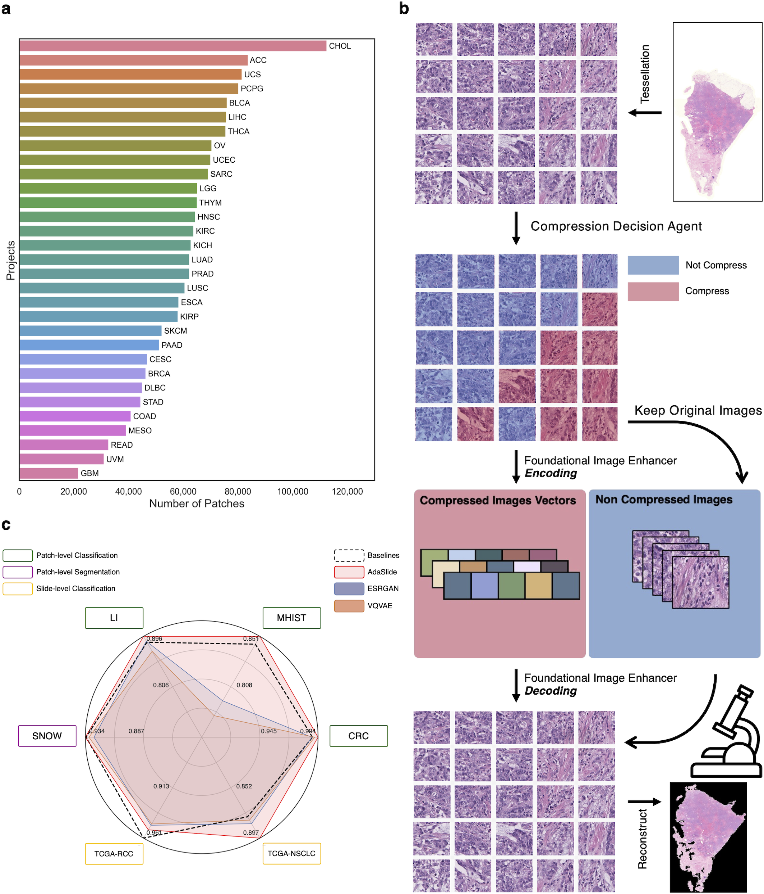
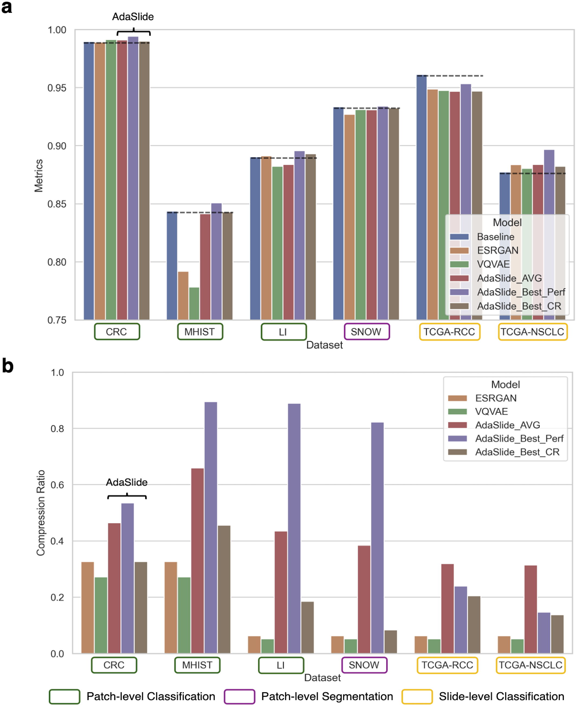

**This repository is not maintained. Code's will be updated in [PathFinder Lab Github](https://github.com/PathfinderLab/AdaSlide)**

# AdaSlide 
Adaptive Compression Framework for Giga-pixel Whole Slide Images

## Abstract
Digital pathology images require significant storage space, leading to high costs. To address this, compressing pathology images for storage and restoration has been proposed; however, this involves a trade-off between compression ratio and information loss. Traditional compression techniques often apply a uniform compression ratio, ignoring the variable informational content across different slide regions (information disequilibrium). \textbf{AdaSlide}, an **Ada**ptive compression framework for giga-pixel whole **Slide** images, overcomes this limitation by integrating a compression decision agent (CDA) and a foundational image enhancer (FIE), enabling adaptive compression decisions aware of information disequilibrium. The CDA uses reinforcement learning to assess each patch's necessity and degree of compression, ensuring minimal information loss and maintaining diagnostic integrity. The FIE, trained on diverse cancer types and magnifications, guarantees high-quality post-compression image restoration.

The FIE's performance was evaluated using a visual Turing test, where pathology experts could barely distinguish between real images and compressed-restored images (55\% accuracy, coincidence level: 50\%). In six downstream tasks (including patch-level classification, segmentation, and slide-level classification), AdaSlide maintained the prediction performance of the original images in five out of six tasks. In contrast, traditional methods with a uniform compression ratio only maintained performance in two out of six tasks, raising concerns about information loss. Additionally, AdaSlide could store data using less than 10\% of the original WSI size. This indicates that, unlike traditional methods, AdaSlide can efficiently compress data while preserving clinically significant information. Furthermore, AdaSlide provides flexibility with its study objective-oriented reward function, compression tendency, and FIE backbone architectures. This adaptive approach ensures efficient storage and retrieval, potentially transforming the management of digital pathology data storage systems by aligning compression strategies with clinical relevance, thereby facilitating both cost reduction and improved diagnostic processes.

## Performances
AdaSlide was evaluated on various tasks: patch-level classification, path-level segmentation, and slide-level classifications. AdaSlide maintained the prediction performance of the original images in 5 out of 6 tasks. In contrast, traditional methods with a uniform compression ratio (ESRGNA, VQVAE) only maintained performance in 2 out of 6 tasks, raising concerns about information loss.

## How to install?
I recommend using Anaconda or Miniconda. The Python version is 3.8. This demo was tested on Linux Ubuntu 20.04 with an Intel i7-11th CPU and an RTX 3090 GPU.

1. Type command: `sudo apt -y install libvips-dev openslide-tools`
2. Type command: `pip install -r requirements.txt`
3. Type command: `cd CLAM/smooth-topk; python setup.py install; cd ../..`

## How to use?
1. Define project folders
   - Create a project folder like `Demo_PROJECT` and a `Demo_PROJECT/WSI` folder. Place the WSI file into the `Demo_PROJECT/WSI` folder.
2. Preprocessing
   - `python ./CLAM/create_patches_fp.py --source Demo_PROJECT/WSI --step_size 512 --patch_size 512 --patch --seg --stitch --save_dir Demo_PROJECT/CLAM_prepared --patch_level 1`
3. Enoding
   - `python ./run_encode.py --project Demo_PROJECT --slide_format svs --patch_format jpg --processes 16 --level_of_interest 1 --is_downsample False`
     - In this demo, each project is assumed to contain only a single WSI file.
     - The `is_downsample` option is for WSI files that do not explicitly support 0.5 mpp. For example, you can get a 512x512 image of 0.5 mpp downsampled from a 1024x1024 0.25 mpp.

4. CDA inference
   - `python ./infer_CDA.py --project Demo_PROJECT --patch_format jpg`
   - Before decoding, the FIE weight file should be downloaded from [zenodo](https://zenodo.org/records/11069591). Place the weight files in `CompressionDecisionAgent/weights/` (e.g., **CompressionAgent_lambda-0.10.pt**).
   - The `get_prop` option is for probability output or binary label output. If you want to show probability, add `--get_prop`.\
5. Build feature sets
   - `python ./build_compressed_features.py --project Demo_PROJECT --inference_file ./CompressionDecisionAgent/inferences/CompAgent_inference_task-Demo_PROJECT.csv --lambda_cond lambda_050`
   - Options for lambda_cond: {lambda_000, lambda_010, lambda_025, lambda_050, lambda_075, lambda_100, lambda_inf}
     - lambda_000: compress everything
     - lambda_inf: do not compress
6. Decoding
   - `python ./run_decode.py --project Demo_PROJECT --lambda_cond lambda_050 --patch_format jpg --FIE_weight FIE/net_g_latest.pth`
   - Before decoding, the FIE weight (**net_g_latest.pth**) file should be downloaded from [zenodo](https://zenodo.org/records/11069591)
7. Restore to TIFF file
   - `python ./gen_WSI_readerable_image.py --project Demo_PROJECT --lambda_cond lambda_050 --patch_format jpg --slide_format svs`
   - **Warning**: This step is quite slow because I am not an expert in TIFF file generation. If you have any comments or advice, please leave issues!
